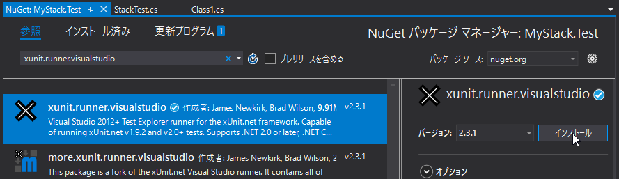

１．米原駅 ～すべてはここから始まった～
=====

スタックの仕様
-----

元文書では言語にJavaが使われているため、C#とは標準的な仕様に若干違いがあります。本文書では以下の仕様で進めます。

- `IsEmpty`プロパティ  
  スタックが空の場合`true`。それ以外`false`を返す。  
  `bool IsEmpty { get; }`
- `Size`プロパティ  
  スタックのサイズを取得する。  
  `int Size { get; }`
- `Push`メソッド  
  引数の値をスタックの一番上に積む。  
  `void Push(int value)`
- `Pop`メソッド  
  スタックの一番上の値を取り除く。  
  `void Pop()`  
  スタックが空の場合、`System.InvalidOperationException`が発生する。
- `Top`メソッド  
  スタックの一番上の値を取得する。  
  `int Top()`  
  スタックが空の場合、`System.InvalidOperationException`が発生する。

プロジェクトの作成
-----

スタックを作成するためのプロジェクトを「クラスライブラリ」プロジェクトとして作成します。

C#ではプロジェクト名は大文字英字始まりとするのが一般的ですが、`Stack`プロジェクトにしてしまうとこの後作成する`Stack`クラスと名前がバッティングしてしまいます。そこで、今回はプロジェクト名は`MyStack`にします。

また、C#はJavaとは違い、テストコードはテスト用プロジェクトに作成します。したがって、［ソリューションのディレクトリを作成］にチェックを入れるようにしましょう。


`MyStack`プロジェクトおよびソリューションが作成されたら、テスト用プロジェクトを追加します。


テスト用プロジェクトはテスト対象の`MyStack`プロジェクトと同じく、「クラスライブラリ」プロジェクトとして作成します。プロジェクト名は`MyStack`プロジェクトに対するテストであることが分かるように`MyStack.Test`にします。


プロジェクト名を`(対象プロジェクト名).Test`のようにすることで、既定の名前空間の先頭が対象プロジェクトと同じになり、`using`文による名前空間のインポートが不要になるという利点があります。

最後に、テスト用プロジェクトにテスト対象プロジェクトへの「参照」を追加します。


xUnit\.netの組み込み
-----

元文書ではJavaにおけるデファクトスタンダードなテスティングフレームワークである「[JUnit](https://junit.org)」を使っています。

本文書ではテスティングフレームワークに「[xUnit.net](https://xunit.github.io/)」を使います。VS組み込みのテスティングフレームワークである「MSTest」もありますが、VSがないところで使いにくいので、最近マイクロソフト製品のテストコードでよくつかわれているxUnit\.netを採用しました。

xUnit\.netを使うには、公式サイトの「[Getting Started](http://xunit.github.io/docs/getting-started-desktop)」を参考に、テスト用プロジェクトにNuGetパッケージ「[xunit](https://www.nuget.org/packages/xunit/)」をインストールします。


テストケースクラスの作成
-----

テストケースクラスの名前は元文書と同じ`StackTest`にします。`MyStack.Text`プロジェクトの`Class1.cs`ファイルを`StackTest.cs`にリネームしましょう。

リネームすると次のダイアログが表示されますので、［はい］ボタンをクリックします。



そして、`StackTest.cs`ファイルを開き、xUnit\.netが使えるように`using`文を使って`Xunit`名前空間をインポートします。なお、クラスのアクセス修飾子は、テスティングフレームワークが外部から参照できるように、`public`のまま変更しないようにしましょう。

```csharp
using System;
using System.Collections.Generic;
using System.Linq;

using Xunit;

namespace MyStack.Test
{
    public class StackTest
    {
    }
}
```
