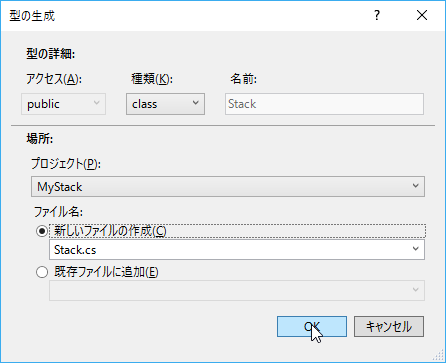
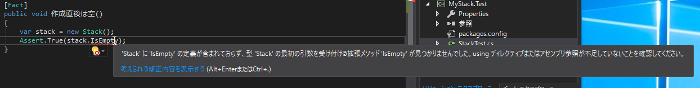
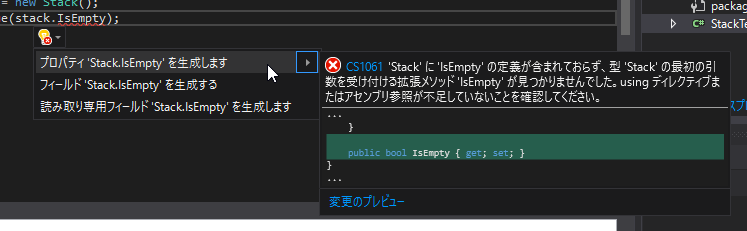
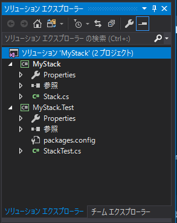

２．長浜駅 ～Assert ファースト～
=====

[↑目次](../README.md "目次")

[← １．米原駅 ～すべてはここから始まった～](01.md "１．米原駅 ～すべてはここから始まった～")

最初のテストメソッド作成
-----

元文書の当時のJUnitは`test～`のように"test"で始まるメソッド名でなければならないというルールがありました(現在のJUnitでは`@Test`アノテーションを付けるというルールに変わっています)。したがって、最初のテストメソッド名は`testCreate`になっています。

xUnit\.netを使った場合、テストメソッドは`Fact`属性を付けるルールになっています。したがって、テストメソッド名に対するルールはありません。ここでは、テストしたい「Stack を new したら空」であることが分かるよう、テストメソッド名は`作成直後は空`として、次のように作成します。

```csharp
using System;
using System.Linq;

using Xunit;

namespace MyStack.Test
{
    public class StackTest
    {
        [Fact]
        public void 作成直後は空()
        {
            Assert.True(stack.IsEmpty);
        }
    }
}
```

`Assert.True`メソッドは引数が`true`であるかどうかを検証します。このように、xUnit\.netでは`Assert`クラスに定義された様々な検証用のstaticメソッドを利用します。

次に元文書の手順に従って、`stack`変数を初期化するコードを書きます。

```csharp
using System;
using System.Linq;

using Xunit;

namespace MyStack.Test
{
    public class StackTest
    {
        [Fact]
        public void 作成直後は空()
        {
            var stack = new Stack();
            Assert.True(stack.IsEmpty);
        }
    }
}
```

変数を宣言する際、C#では`var`キーワードが使えるので、積極的に利用しましょう。


`Stack`クラスの生成
-----

ここまでの`StackTest`クラスのコードを保存すると、`Stack`という型がないため、コンパイルエラーであることを検知して赤波線が表示されます。マウスカーソルをあてることで、その内容を確認できます。


それでは、実際にStackクラスを作りましょう。メッセージに書いてある通り、`Alt`+`Enter`キーを押すか、`Ctrl`+`.`キーを押す、もしくは電球アイコンをクリックして、［型 'Stack' を生成する］－［新しい型の生成…］を選択してください。


既定では、コードファイルのあるプロジェクト、つまり`MyStack.Test`プロジェクトにファイルが作成されてしまうので、［プロジェクト］を`MyStack`に変更して［OK］ボタンをクリックします。



すると、`MyStack`プロジェクトに新たに`Stack.cs`ファイルが作成され、`Stack`クラスのひな型コードが生成されます。`StackTest`クラス内の`Stack`にカーソルを合わせ、`F12`キーを押すとその定義個所にジャンプできます。

```csharp
namespace MyStack
{
    public class Stack
    {
        public Stack()
        {
        }
    }
}
```

`IsEmpty`プロパティの仮実装
-----

元文書と同様、今度は`IsEmpty`プロパティを使った個所にコンパイルエラーが表示されます。



クラスの生成と同様に、今度は`IsEmpty`プロパティを生成します。



```csharp
namespace MyStack
{
    public class Stack
    {
        public Stack()
        {
        }

        public bool IsEmpty { get; set; }
    }
}
```

生成された`IsEmpty`プロパティは、最初のテストが失敗するよう`false`を戻すよう、式定義の形で書き換えます。

```csharp
public bool IsEmpty => false;
```

以上で`StackTest`クラスにも`Stack`クラスにもコンパイルエラーがなくなるのが確認できるはずです。`Ctrl`+`Shift`+`B`キーなどで、［ソリューションのビルド］をして確かめましょう。

