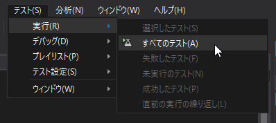
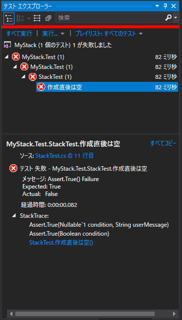
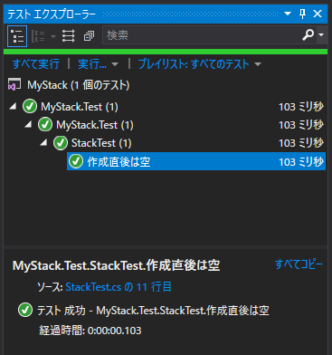

３．長浜と敦賀の間 ～最初は赤で、次に緑、そしてリファクタリング！！～
=====

[↑目次](../README.md "目次")

[← ２．長浜駅 ～Assert ファースト～](02.md "２．長浜駅 ～Assert ファースト～")

テストの実行
-----

VSでテストを実行するには、［テスト］メニューの［実行］－［すべてのテスト］を選択します。



実行した結果は［テストエクスプローラー］に表示されます。予想通り、テストが失敗して「赤(Red)」になっていることが分かります(［テストエクスプローラー］が表示されていないときは、［テスト］メニューの［ウィンドウ］－［テストエクスプローラー］を選択します)。




`IsEmpty`プロパティの仮実装
-----

「テストを通すための最小のコード」として、`Stack`クラスの`IsEmpty`プロパティの式を`false`から`true`に変更します。

```csharp
namespace MyStack
{
    public class Stack
    {
        public Stack()
        {
        }

        public bool IsEmpty => true;  // falseからtrueにする
    }
}
```

こういった実装のことを元文書では「Fake It!」と呼んでいますが、現在では日本語で「仮実装」ともよく言われます。

この状態てテストを再度実行し、テストが成功して「緑(Green)」になっていることを確認しましょう。なお、テストの実行は［テストエクスプローラー］の中の［すべて実行］リンクをクリックすることでも行えます。


