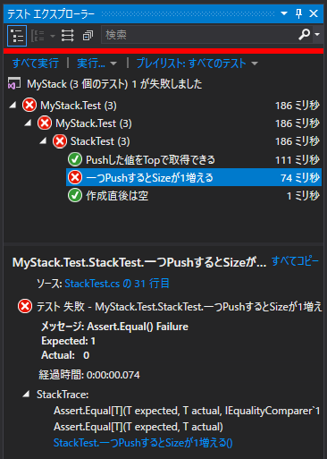

３．長浜と敦賀の間 ～最初は赤で、次に緑、そしてリファクタリング！！～
=====

[↑目次](../README.md "目次")

[← ２．長浜駅 ～Assert ファースト～](02.md "２．長浜駅 ～Assert ファースト～")

テストの実行
-----

VSでテストを実行するには、［テスト］メニューの［実行］－［すべてのテスト］を選択します。


実行した結果は［テストエクスプローラー］に表示されます。予想通り、テストが失敗して「赤(Red)」になっていることが分かります(［テストエクスプローラー］が表示されていないときは、［テスト］メニューの［ウィンドウ］－［テストエクスプローラー］を選択します)。


［テストエクスプローラー」では、失敗したテストを選択すると、その原因が確認できます。今回の例では、「期待値(Expected)がTrueに対して、実際(Actual)はFalseだった」ということが分かります。

`IsEmpty`プロパティの仮実装
-----

「テストを通すための最小のコード」として、`Stack`クラスの`IsEmpty`プロパティの式を`false`から`true`に変更します。

```csharp
namespace MyStack
{
    public class Stack
    {
        public Stack()
        {
        }

        public bool IsEmpty => true;  // falseからtrueにする
    }
}
```

こういった実装のことを元文書では「Fake It!」と呼んでいますが、現在では日本語で「仮実装」ともよく言われます。

この状態てテストを再度実行し、テストが成功して「緑(Green)」になっていることを確認しましょう。なお、テストの実行は［テストエクスプローラー］の中の［すべて実行］リンクをクリックすることでも行えます。


`Push`メソッドのテストを作成
-----

元文書に書いてある通り、「`Push`メソッドの確認を`Top`プロパティを利用して」確認してみましょう。テストメソッド名はより実態をあらわした`Pushした値をTopで取得できる`にしました。


```csharp
using System;
using System.Linq;

using Xunit;

namespace MyStack.Test
{
    public class StackTest
    {
        [Fact]
        public void 作成直後は空()
        {
            var stack = new Stack();
            Assert.True(stack.IsEmpty);
        }

        [Fact]
        public void Pushした値をTopで取得できる()
        {
            var stack = new Stack();
            Assert.Equal(1, stack.Top);
        }
    }
}
```

次に、共通部分をセットアップ処理に追い出します。xUnit\.netでは、テストクラスのコンストラクターで行います。

```csharp
using System;
using System.Linq;

using Xunit;

namespace MyStack.Test
{
    public class StackTest
    {
        private Stack stack;

        public StackTest()
        {
            stack = new Stack();
        }

        [Fact]
        public void 作成直後は空()
        {
            Assert.True(stack.IsEmpty);
        }
/*
        [Fact]
        public void Pushした値をTopで取得できる()
        {
            var stack = new Stack();
            Assert.Equal(1, stack.Top);
        }
*/
    }
}
```

テストを実行して「緑」のままであることを確認するのを忘れないようにしましょう。

そして、`Pushした値をTopで取得できる`メソッドのコメントアウトを戻し、改めて`Push`メソッドの呼び出しを追加して完成させましょう。

```csharp
[Fact]
public void Pushした値をTopで取得できる()
{
    // var stack = new Stack();  ← 元文書にあるがおそらく間違いなので削除
    stack.Push(1);
    Assert.Equal(1, stack.Top);
}
```

なお、元文書では「ドライバー」である平鍋氏ではなく、「ナビゲーター」である北野氏がpushし忘れていることに気づいています。このように一人では気づかないミスが、複数人の目があることで発見されやすくなるのが、ペアプログラミングの良いところの一つです。


`Push`メソッドと`Top`プロパティの仮実装
-----

まず、コンパイルエラーを解消するために`Push`メソッドと`Top`プロパティを生成します。

```csharp
using System;

namespace MyStack
{
    public class Stack
    {
        public Stack()
        {
        }

        public bool IsEmpty => true;

        public int Top { get; set; }

        public void Push(int value)
        {
            throw new NotImplementedException();
        }
    }
}
```

`Top`プロパティを生成すると、型が`IEnumerable<T>`になってしまいますので、`int`型に戻します。また、`Push`メソッドの引数名は既定で`v`になっているので、`value`のように省略しない名称に直します。

この状態で実行すると、無事テストは失敗して「赤」になります。


テストを通すために仮実装を行いましょう。`Push`メソッドを空に、`Top`プロパティは`1`を戻すようにします。

```csharp
using System;

namespace MyStack
{
    public class Stack
    {
        public Stack()
        {
        }

        public bool IsEmpty => true;

        public int Top => 1;  // 1を戻す

        public void Push(int value)
        {
            // 中身を空にする
        }
    }
}
```

テストを実行して成功することを確認しましょう。このとき全部のテストを実行することを忘れないようにしてください。これは、行った変更で他のバグを埋め込んでいないかを確認するためです。


`Push`メソッドと`Top`プロパティのリファクタリング
-----

元文書同様、`Push`メソッドでフィールドに値を設定し、`Top`プロパティでその値を返すようにしましょう。

```csharp
using System;

namespace MyStack
{
    public class Stack
    {
        private int value;

        public Stack()
        {
        }

        public bool IsEmpty => true;

        public int Top => value;

        public void Push(int value)
        {
            this.value = value;
        }
    }
}
```

この後、テストを実行して「緑」のままであることを必ず確認してください。


`Size`プロパティの仮実装
-----

これまでと同様の手順で、`Size`プロパティの仮実装まで行っていきましょう。

まずはテストを作成します。

```csharp
using System;
using System.Linq;

using Xunit;

namespace MyStack.Test
{
    public class StackTest
    {
        // ... 略

        [Fact]
        public void 一つPushするとSizeが1増える()
        {
            stack.Push(1);
            Assert.Equal(1, stack.Size);
        }
    }
}
```

コンパイルエラーを解消するために、`Stack`クラスに`Size`プロパティを作成します。

```csharp
using System;

namespace MyStack
{
    public class Stack
    {
        // ... 略

        public int Size { get; set; } // 生成して型をintにする

        public void Push(int value)
        {
            this.value = value;
        }
    }
}
```

テストを実行して「赤」になることを確認します。



`Size`プロパティが1を返すよう仮実装を行います。

```csharp
public int Size => 1;
```

テストを実行して「緑」になることを確認しておきましょう。

現時点の完全なコードは次の通りです。

```csharp
using System;
using System.Linq;

using Xunit;

namespace MyStack.Test
{
    public class StackTest
    {
        private Stack stack;

        public StackTest()
        {
            stack = new Stack();
        }

        [Fact]
        public void 作成直後は空()
        {
            Assert.True(stack.IsEmpty);
        }

        [Fact]
        public void Pushした値をTopで取得できる()
        {
            stack.Push(1);
            Assert.Equal(1, stack.Top);
        }

        [Fact]
        public void 一つPushするとSizeが1増える()
        {
            stack.Push(1);
            Assert.Equal(1, stack.Size);
        }
    }
}
```

```csharp
namespace MyStack
{
    public class Stack
    {
        private int value;

        public Stack()
        {
        }

        public bool IsEmpty => true;

        public int Top => value;

        public int Size => 1;

        public void Push(int value)
        {
            this.value = value;
        }
    }
}
```

[→ ４．敦賀駅 ～とらいあんぎゅれーしょん？？～](doc/04.md "４．敦賀駅 ～とらいあんぎゅれーしょん？？～")