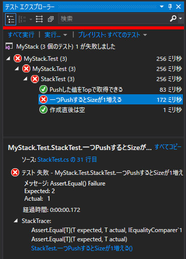
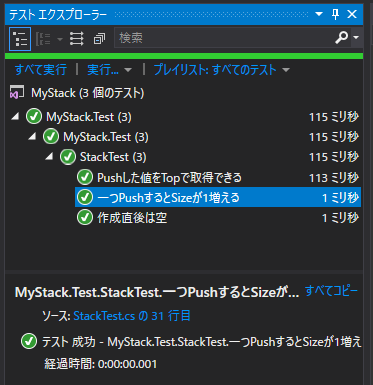

４．敦賀駅 ～とらいあんぎゅれーしょん？？～
=====

[↑目次](../README.md "目次")

[← ３．長浜と敦賀の間 ～最初は赤で、次に緑、そしてリファクタリング！！～](03.md "３．長浜と敦賀の間 ～最初は赤で、次に緑、そしてリファクタリング！！～")

複数回Pushした時のSizeを確かめる
-----

元文書にしたがって、`Push`メソッドをもう一度行って`Size`プロパティを確認するよう、テストコードを変更します。

```csharp
[Fact]
public void 一つPushするとSizeが1増える()
{
    stack.Push(1);
    Assert.Equal(1, stack.Size);
    stack.Push(2);                  // 追加
    Assert.Equal(2, stack.Size);    // 
}
```

テストが赤くなることを確認します。



次に、緑にするためにコードを変更します(ペア/トリオなど複数人で行っているなら、元文書のようにドライバーを交代することをお勧めします)。

```csharp
namespace MyStack
{
    public class Stack
    {
        private int value;
        private int size;

        public Stack()
        {
        }

        public bool IsEmpty => true;

        public int Top => value;

        public int Size => size;

        public void Push(int value)
        {
            this.value = value;
            size++;
        }
    }
}
```

そして、テストが緑になることを確認します。



