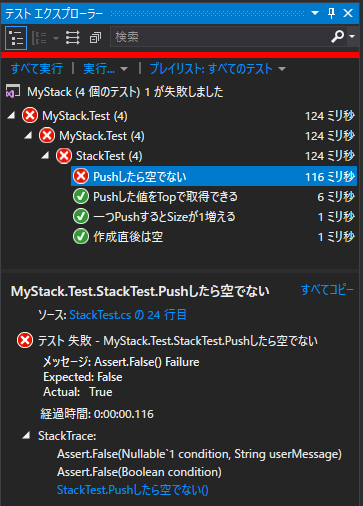

４．敦賀駅 ～とらいあんぎゅれーしょん？？～
=====

[↑目次](../README.md "目次")

[← ３．長浜と敦賀の間 ～最初は赤で、次に緑、そしてリファクタリング！！～](03.md "３．長浜と敦賀の間 ～最初は赤で、次に緑、そしてリファクタリング！！～")

複数回Pushした時のSizeを確かめる
-----

元文書にしたがって、`Push`メソッドをもう一度行って`Size`プロパティを確認するよう、テストコードを変更します。

```csharp
[Fact]
public void 一つPushするとSizeが1増える()
{
    stack.Push(1);
    Assert.Equal(1, stack.Size);
    stack.Push(2);                  // 追加
    Assert.Equal(2, stack.Size);    // 
}
```

テストが赤くなることを確認します。


次に、緑にするためにコードを変更します(ペア/トリオなど複数人で行っているなら、元文書のようにドライバーを交代することをお勧めします)。

```csharp
namespace MyStack
{
    public class Stack
    {
        private int value;
        private int size;

        public Stack()
        {
        }

        public bool IsEmpty => true;

        public int Top => value;

        public int Size => size;

        public void Push(int value)
        {
            this.value = value;
            size++;
        }
    }
}
```

そして、テストが緑になることを確認します。


Pushした後のIsEmptyを確かめる
-----

元文書では`testPushAndTop`メソッドに`isEmpty`メソッドのテストを追加していますが、テストメソッドは「一つのことを確かめる」ように作るのが原則です。したがって、本文書では別にテストメソッドを追加します。

```csharp
public class StackTest
{
    // ... 略

    [Fact]
    public void 作成直後は空()
    {
        Assert.True(stack.IsEmpty);
    }

    [Fact]
    public void Pushしたら空でない()    // 追加
    {
        stack.Push(1);
        Assert.False(stack.IsEmpty);
    }

    // ... 略
}
```

なぜこのようにするかというと、仮に元文書のように`testPushAndTop`メソッドに追加してしまうと、実装を間違ったときに、`Top`プロパティ、`IsEmpty`プロパティのどちらを間違ったのか、すぐに判断できなくなってしまうためです。

それでは、テストを実行して追加したテストメソッドが赤になることを確認しましょう。



そして、元文書のように`IsEmpty`プロパティの実装を変更します。

```csharp
public bool IsEmpty => size == 0;
```

テストを実行して緑になることを確認しましょう。


