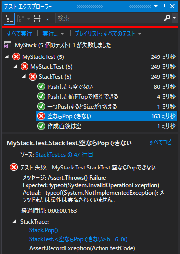
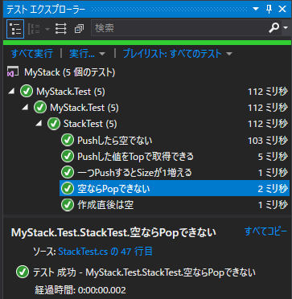
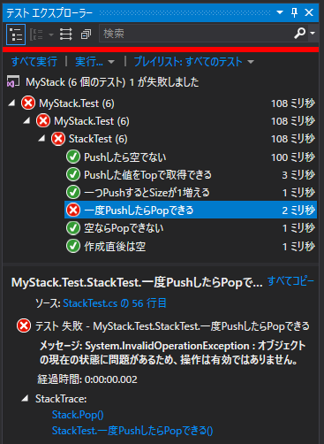
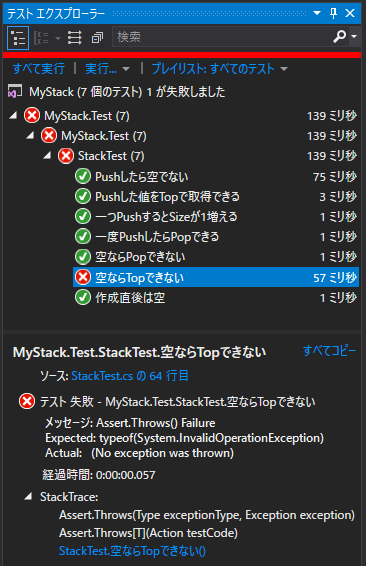
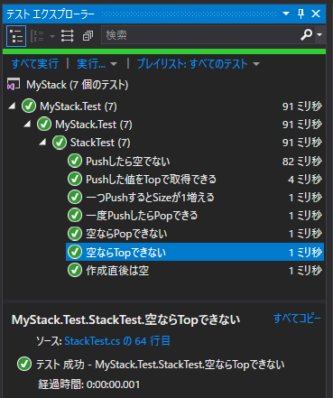

５．北陸トンネルね！いっちょらい！ ～Exception テスト～
=====

[↑目次](../README.md "目次")

[← ４．敦賀駅 ～とらいあんぎゅれーしょん？？～](doc/04.md "４．敦賀駅 ～とらいあんぎゅれーしょん？？～")

空ならPopできない
-----

空のスタックに対して`Pop`メソッドを読んだときに、`InvalidOperationException`が発生することを確認するテストを追加します。

```csharp
[Fact]
public void 空ならPopできない()
{
    Assert.Throws<InvalidOperationException>(() =>
    {
        stack.Pop();
    });
}
```

xUnit\.netでは、特定の例外を期待するテストは、`Assert.Throws`メソッドを使います。この時、期待する例外の型を型引数に、例外が発生する処理をラムダ式で指定します。

`Pop`メソッドがないので、これまでと同様に生成します。

```csharp
public void Pop()
{
    throw new NotImplementedException();
}
```

そしてテストを実行して赤になることを確認します。



テスト結果を見ると、発生した例外の期待した型と実際の型が異なっていることが分かります。

それでは、テストを通すために`Pop`メソッドで`throw`している例外の型を、期待している`InvalidOperationException`に変更しましょう。

```csharp
public void Pop()
{
    throw new InvalidOperationException();
}
```

テストを実行して緑になること確認します。




一度PushしたらPopできる
-----

今度はPushしたあとにPopできるように変更します。元文書のようにドライバーを変更して、次のテストメソッドを追加します。

```csharp
[Fact]
public void 一度PushしたらPopできる()
{
    stack.Push(1);
    stack.Pop();
    //Assert.Equal(0, stack.Size);  おそらく間違いなので削除
}
```

このテストの目的には`Size`プロパティは関係ないので、元文書の`size`メソッドに対する検証行は削除します。

それでは、テストが赤になることを確認しましょう。



そして、テストが通るように`Pop`メソッドを変更します。

```csharp
public void Pop()
{
    if (IsEmpty) throw new InvalidOperationException();
}
```

C#では、基本的に`if`文の`{`、`}`は省略しませんが、今回のように`throw`したり`return`する場合は、特例として「１行で書くこと」を条件に、省略してしまうこともよくあります。

テストを実行して緑になることを確認しておきましょう。


空ならTopできない
-----

`Pop`メソッドと同様に、`Top`プロパティでも空なら例外が発生するようにしていきましょう。

まずはいつものようにテストメソッドを追加します。

```csharp
[Fact]
public void 空ならTopできない()
{
    Assert.Throws<InvalidOperationException>(() =>
    {
        var _ = stack.Top;
    });
}
```

`Top`はプロパティであるため、代入するコードにしないとコンパイルエラーになってしまいます。それを回避するために、`var _ = ...`のように慣習として「使い捨ての変数であること」を表す変数`_`に代入しています。

テストメソッドを追加したら、テストを実行して赤になることを確認しましょう。



その後、`Pop`メソッドを参考に`InvalidOperationException`をスローするよう、`Top`プロパティの実装を変更し、テストを実行して緑になることを確認しましょう。

```csharp
public int Top
{
    get
    {
        if (IsEmpty) throw new InvalidOperationException();
        return value;
    }
}
```

`if`文で分岐するため、`Top`プロパティの定義を式形式からブロック形式に変更します。

なお、C# 7から条件演算子(`条件 ? 真の値 : 偽の値`)の`:`の前後でも`throw`を書けるようになっているので、それを利用すると式形式のまま次のように書くこともできます。

```csharp
public int Top =>
    IsEmpty
    ? throw new InvalidOperationException()
    : value;
```

ここではブロック形式を採用し、元文書のように空かどうか判定して例外を`throw`する処理を、メソッドに抽出します。

```csharp
public class Stack
{
    // ... 略

    public int Top
    {
        get
        {
            AssertNotEmpty();
            return value;
        }
    }

    // ... 略

    public void Pop()
    {
        AssertNotEmpty();
    }

    private void AssertNotEmpty()
    {
        if (IsEmpty) throw new InvalidOperationException();
    }
}
```

メソッドに抽出したあとは、必ずテストを実行して緑のままであることを確認しましょう。


