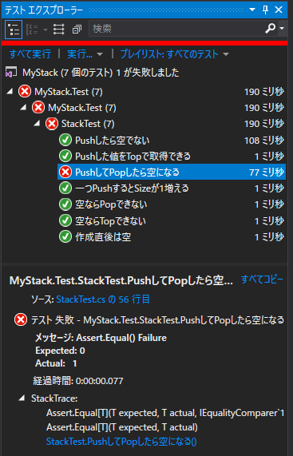
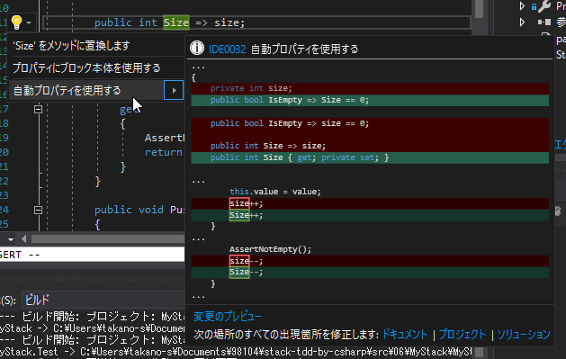
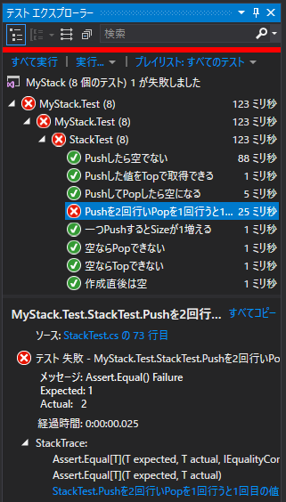
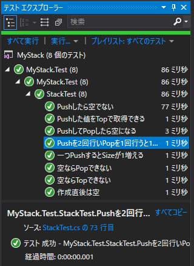

６．トンネルを抜けると、そこは？！ ～TDD ラストスパート～
=====

[↑目次](../README.md "目次")

[← ５．北陸トンネルね！いっちょらい！ ～Exception テスト～](05.md "５．北陸トンネルね！いっちょらい！ ～Exception テスト～")

PushしてPopしたら空になる
-----

Popしたら一番上の要素を取り除くことを確認するため、テストコードを追加します。元文書では`testPushAndPop`メソッドでやっていますが、本文書では対応するテストメソッド名を変更して、`Size`を確認するようにしてみましょう。

```csharp
[Fact]
// public void 一度PushしたらPopできる()    メソッド名を変更
public void PushしてPopしたら空になる()
{
    stack.Push(1);
    stack.Pop();
    Assert.Equal(0, stack.Size);    // 前の章では削除していたコードを復活
}
```

テストが赤になることを確認しましょう。



そして、元文書のように`Pop`メソッドで`size`フィールドをデクリメントするコードを追加し、テストが緑になることを確認します。

```csharp
public void Pop()
{
    AssertNotEmpty();
    size--;             // 追加
}
```

さて、ここまでのコードを見ると、`size`フィールドは`Size`プロパティの「バッキングフィールド」としか使っていないことが分かります。C#のプロパティは、`set`のみ`private`にするようなアクセス制限が可能ですので、そのように変更してしまいましょう。

この操作は、`Size`プロパティの行にカーソルをあて、`Ctrl`+`.`キーでクイック操作を開き、［自動プロパティを使用する］を選択すると、自動で変換してくれます。



変換した後は、すべての個所で`Size`プロパティが使われるように変更されます。

```csharp
public bool IsEmpty => Size == 0;

public int Size { get; private set; }

public void Push(int value)
{
    this.value = value;
    Size++;
}

public void Pop()
{
    AssertNotEmpty();
    Size--;
}
```


複数段のスタックに拡張する
-----

いよいよ大詰めです。スタックを１段から複数団に拡張しましょう。

まずはテストメソッドを追加します。ほぼ元文書のままですね。

```csharp
[Fact]
public void Pushを2回行いPopを1回行うと1回目の値がTopで取得できる()
{
    stack.Push(1);
    stack.Push(2);
    Assert.Equal(2, stack.Size);

    stack.Pop();
    Assert.Equal(1, stack.Top);
}
```

テストを実行して赤になることを確認しましょう。



そして、元文書と同じように`int[]`を使って複数段のスタックを実現しましょう。

```csharp
private int[] values = new int[10];

public void Push(int value)
{
    values[Size] = value;
    Size++;
}

public int Top
{
    get
    {
        AssertNotEmpty();
        return values[Size - 1];
    }
}
```

なお、`Push`メソッドの中で、元文書では配列のインデックスに直接`size++`のように、インクリメント演算子を適用した結果を使っています。これは、後置のインクリメント演算子の評価結果がインクリメントする前の値であることを利用しています(配列のインデックスに現在の`size`の値を使用した後、`size`が1増える)。

しかし、この仕様は正直混乱を招きやすいので、本文書のコードではスタックの一番上に積んだ後に、`Size`プロパティをインクリメントするように変更しています。

そして、テストを実行して緑になれば完成です！



完成したテストコードと製品コードは次の通りです。

```csharp
using System;

using Xunit;

namespace MyStack.Test
{
    public class StackTest
    {
        private Stack stack;

        public StackTest()
        {
            stack = new Stack();
        }

        [Fact]
        public void 作成直後は空()
        {
            Assert.True(stack.IsEmpty);
        }

        [Fact]
        public void Pushしたら空でない()
        {
            stack.Push(1);
            Assert.False(stack.IsEmpty);
        }

        [Fact]
        public void Pushした値をTopで取得できる()
        {
            stack.Push(1);
            Assert.Equal(1, stack.Top);
        }

        [Fact]
        public void 一つPushするとSizeが1増える()
        {
            stack.Push(1);
            Assert.Equal(1, stack.Size);
            stack.Push(2);
            Assert.Equal(2, stack.Size);
        }

        [Fact]
        public void 空ならPopできない()
        {
            Assert.Throws<InvalidOperationException>(() =>
            {
                stack.Pop();
            });
        }

        [Fact]
        public void PushしてPopしたら空になる()
        {
            stack.Push(1);
            stack.Pop();
            Assert.Equal(0, stack.Size);
        }

        [Fact]
        public void 空ならTopできない()
        {
            Assert.Throws<InvalidOperationException>(() =>
            {
                var _ = stack.Top;
            });
        }

        [Fact]
        public void Pushを2回行いPopを1回行うと1回目の値がTopで取得できる()
        {
            stack.Push(1);
            stack.Push(2);
            Assert.Equal(2, stack.Size);

            stack.Pop();
            Assert.Equal(1, stack.Top);
        }
    }
}
```

```csharp
using System;

namespace MyStack
{
    public class Stack
    {
        public int Size { get; private set; }

        public bool IsEmpty => Size == 0;

        private int[] values = new int[10];

        public void Push(int value)
        {
            values[Size] = value;
            Size++;
        }

        public int Top
        {
            get
            {
                AssertNotEmpty();
                return values[Size - 1];
            }
        }

        public void Pop()
        {
            AssertNotEmpty();
            Size--;
        }

        private void AssertNotEmpty()
        {
            if (IsEmpty) throw new InvalidOperationException();
        }
    }
}
```
